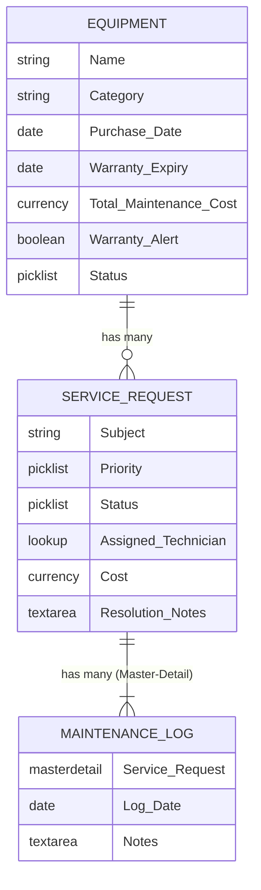
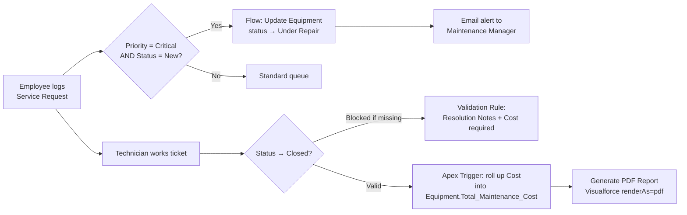
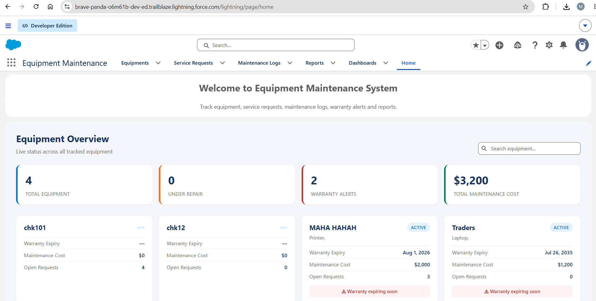
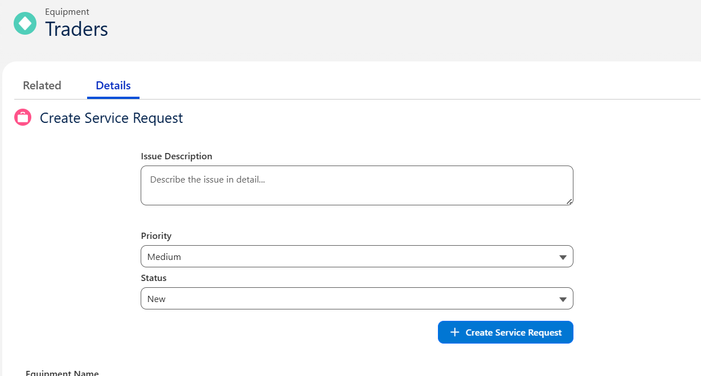
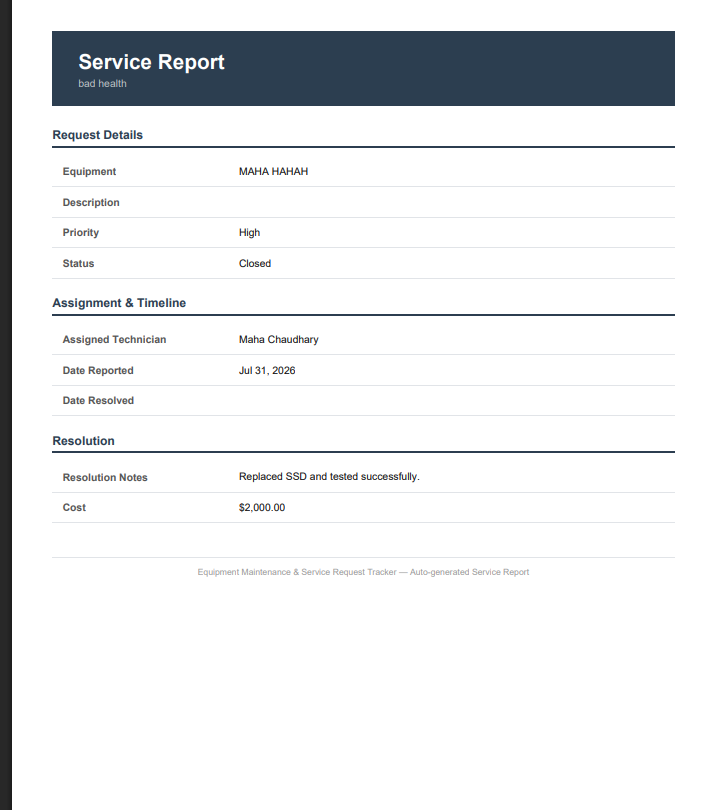

<div align="center">

# 🛠️ Equipment Maintenance & Service Request Tracker

### A full end-to-end Salesforce application — data model → automation → custom UI → PDF reporting

[](https://www.salesforce.com/)
[](#)
[](#)
[](#)
[](#)

*Built as a realistic, end-to-end simulation of how equipment breakdowns get logged, tracked, resolved, and reported on in a real organization.*

**[View Repo](https://github.com/Mahachaudhaary/equipment-maintenance-tracker)**

</div>

---

## 📖 Overview

Companies that own physical equipment — laptops, printers, HVAC units, forklifts — need a way to track breakdowns, assign technicians, enforce process discipline, and prove maintenance history for warranty and vendor purposes.

This project is a **complete Salesforce implementation** of that workflow, built to exercise every core skill in the platform: custom objects and relationships, validation rules, declarative automation (Flow), Apex triggers and batch jobs, a custom Lightning Web Component dashboard, PDF generation, and executive-level reporting — in that order, the way a real Salesforce build actually progresses.

> 🎥 **[Add a 60–90 second demo GIF or Loom link here]** — this is the single highest-impact thing you can add. A recruiter or Fiverr buyer will watch a 30-second clip before they read a single line below.

---

## ✨ What It Does

| Capability | Description |
|---|---|
| 📋 **Track equipment** | Central registry of all company equipment with warranty and category data |
| 🎫 **Log service requests** | Employees raise a request the moment something breaks |
| ⚙️ **Auto-escalate critical issues** | A Flow instantly flags equipment and alerts managers when a *Critical* request comes in |
| 🚧 **Enforce clean data** | Validation rules block bad states (closing a ticket with no resolution notes, negative costs, missing technician, etc.) |
| 💰 **Roll up maintenance cost** | An Apex trigger automatically totals repair costs per piece of equipment |
| ⏰ **Catch expiring warranties** | A scheduled Apex batch job scans weekly and flags equipment nearing warranty expiry |
| 🧾 **Generate PDF reports** | One click produces a professional PDF service report, auto-attached to the record |
| 📊 **Visual dashboard** | Custom LWC card-based overview — live status, warranty alerts, and cost totals at a glance |

---

## 🏗️ Architecture

### Data Model



### Automation Flow



---

## 🧩 Tech Stack & Skills Demonstrated

<div align="center">

| Layer | Tools Used |
|---|---|
| **Data Model** | Custom Objects, Master-Detail & Lookup Relationships, Page Layouts |
| **App Config** | Custom Lightning App, Permission Sets (Technician / Maintenance Manager), App Builder Home Page |
| **Data Integrity** | 4 field-level Validation Rules (`ERROR()`, cross-field date logic, conditional required fields) |
| **Declarative Automation** | Record-Triggered Flow with fault path handling |
| **Apex Development** | Trigger Handler pattern, bulkified logic, Batchable + Schedulable Apex, 90%+ test coverage incl. bulk (200-record) and negative tests |
| **Custom UI** | Two LWCs — `serviceRequestQuickForm` (with `@wire`, `@AuraEnabled` Apex, toast notifications) and `equipmentDashboard` (custom visual overview) |
| **Document Generation** | Visualforce PDF (`renderAs="pdf"`) saved as a `ContentVersion` attached to the record |
| **Analytics** | Custom Reports + Dashboard pinned to the app Home page |

</div>

---

## 📸 Screenshots

> Replace these placeholders with real screenshots — see the checklist below for exactly what to capture.

| Custom App Home / Dashboard | Service Request Quick Form (LWC) | Generated PDF Report |
|---|---|---|
|  |  |  |

**Screenshots to grab (put them in `docs/screenshots/`):**
1. Custom App Home page with the equipment dashboard visible
2. Equipment record page showing the `serviceRequestQuickForm` LWC in action
3. A validation rule error message (proves the data-integrity layer works)
4. The Flow canvas for the Critical-priority automation
5. A generated PDF service report, opened
6. The final Dashboard (Open Requests by Priority/Technician + Cost by Category)

---

## 📁 Project Structure

```
force-app/main/default/
├── classes/
│   ├── EquipmentMaintenanceBatch.cls           # Weekly warranty-expiry scan
│   ├── EquipmentMaintenanceScheduler.cls       # Schedules the batch job
│   ├── EquipmentDashboardController.cls        # Powers the visual dashboard LWC
│   ├── ServiceReportController.cls             # Powers the PDF Visualforce page
│   ├── ServiceRequestController.cls            # Apex backend for the quick-form LWC
│   ├── ServiceRequestTriggerHandler.cls        # Cost roll-up on Closed status
│   └── ServiceRequestTriggerHandlerTest.cls    # 90%+ coverage, bulk + negative tests
├── lwc/
│   ├── serviceRequestQuickForm/                # Log a new Service Request
│   └── equipmentDashboard/                     # Visual card-based overview
├── pages/
│   └── ServiceReportPDF.page                   # Visualforce → PDF report
├── flexipages/                                 # Custom App Home page layout
├── layouts/                                    # Page layouts (Equipment, Service Request)
├── permissionsets/                             # Technician, Maintenance_Manager
├── triggers/
└── objects/
    ├── Equipment__c/
    ├── Service_Request__c/
    └── Maintenance_Log__c/
```

---

## 🚀 Setup / Deployment

Buildable end-to-end on a **free Salesforce Developer Edition org** — no paid features required.

```bash
# Clone the repo
git clone https://github.com/Mahachaudhaary/equipment-maintenance-tracker.git
cd equipment-maintenance-tracker

# Authenticate with your Dev Org (Salesforce CLI)
sf org login web --alias devOrg

# Deploy the metadata
sf project deploy start --target-org devOrg

# Assign yourself a permission set to explore role-based access
sf org assign permset --name Maintenance_Manager --target-org devOrg
```

Then open the **Equipment Maintenance** app in Lightning, create an Equipment record, and log a Critical Service Request to see the Flow, validation rules, Apex roll-up, and PDF generation fire in sequence.

---

## 🎬 Demo Walkthrough

1. Open the custom app → land on the Home dashboard
2. Create an Equipment record
3. Log a **Critical** Service Request → watch the Flow auto-update Equipment status + fire the manager email alert
4. Try to close the request without resolution notes → validation rule blocks it with a clear, field-specific error
5. Fill in resolution notes and cost, close it → Apex trigger rolls the cost into Equipment's `Total_Maintenance_Cost__c`
6. Click **Generate PDF Report** → a formatted PDF lands as an attached file
7. Use the `serviceRequestQuickForm` LWC directly from the Equipment record page
8. View the `equipmentDashboard` on the Home page for a live visual overview

---

## 🧠 Design Decisions & Learnings

- **Master-Detail for Maintenance Log, Lookup for Service Request → Technician:** chosen to practice both relationship types and to enable rollup summary behavior where ownership/deletion should cascade.
- **Flow over Apex trigger for the Critical-priority escalation:** kept declarative-first per Salesforce best practice — no code needed for a single conditional update + email.
- **Trigger handler pattern, zero logic in the trigger body:** keeps the trigger bulk-safe and testable, avoids SOQL/DML inside loops.
- **Visualforce `renderAs="pdf"`** chosen over a third-party PDF library since it's the most widely-tested, interview-relevant approach still used in production orgs today.

---

## 📬 About This Project

Built by **Maha Chaudhary** — Computer Engineering student (COMSATS University, Lahore) and Salesforce developer, as a self-directed portfolio project covering the full admin-to-developer skill stack.

- 💼 Available for Salesforce development, automation, and Apex/LWC work — [Fiverr Profile](#) · [Contra Profile](#)
- 📧 [your email here]
- 🔗 [LinkedIn](#)

</div>

# Salesforce DX Project

Salesforce DX is a development approach that brings source-driven development, team collaboration, and continuous integration to the Salesforce Platform. Instead of working directly in an org through a web browser, you work with metadata as source files in a local DX project, track changes in version control, and deploy through automated processes.

This project template gets you started with the tools and structure you need to build Salesforce applications using source control, scratch orgs, and the Salesforce CLI.

## Prerequisites

Before you start, make sure you have:

- **Salesforce CLI** - Download from [developer.salesforce.com/tools/salesforcecli](https://developer.salesforce.com/tools/salesforcecli). See [Install Salesforce CLI](https://developer.salesforce.com/docs/atlas.en-us.sfdx_setup.meta/sfdx_setup/sfdx_setup_install_cli.htm) for details.
- **VS Code with Salesforce Extension Pack** - See [Installation Instructions](https://developer.salesforce.com/docs/platform/sfvscode-extensions/guide/install.html) for details. Includes the Agentforce Vibes extension.
- **A development org** - Sign up for a free Developer Edition org [here](https://developer.salesforce.com/signup).
- **Dev Hub enabled** (optional, required to create scratch orgs) - You can enable Dev Hub in your development org under Setup > Dev Hub.  See [Provide Developers Access to Salesforce DX Tools](https://developer.salesforce.com/docs/atlas.en-us.sfdx_dev.meta/sfdx_dev/sfdx_setup_dx_tools.htm).

## Project Structure

Your DX project follows this structure:

- **`force-app/main/default/`** - Your metadata source files live in this default package directory. You can configure additional package directories in the `sfdx-project.json` file.
- **`config/`** - Scratch org definitions and project settings
- **`scripts/`** - Automation scripts for common tasks
- **`sfdx-project.json`** - Project manifest that defines package directories, namespace, API version, and other project-level settings

See [Salesforce DX Project Configuration](https://developer.salesforce.com/docs/atlas.en-us.sfdx_dev.meta/sfdx_dev/sfdx_dev_ws_config.htm).

## Get Started

Ready to start developing? The [Get Started with Salesforce DX](https://developer.salesforce.com/docs/atlas.en-us.sfdx_dev.meta/sfdx_dev/sfdx_dev_get_started_dx.htm) guide walks you through your first project, from creating a scratch org to creating a simple Apex class or LWC to deploying your code to a sandbox.

## Common Salesforce CLI Commands

Here are common CLI commands that you'll use the most:

- `sf org login web`: Authorize an org
- `sf org open`: Open your org in a browser
- `sf org create scratch`: Create a scratch org
- `sf project deploy start`: Deploy metadata to your org
- `sf project retrieve start`: Retrieve metadata from your org
- `sf template generate <artifact>`: Scaffold new components, such as Apex classes and triggers, LWC components, Lightning apps, and more
- `sf apex <command>`: Run Apex tests, run anonymous Apex blocks, and view logs
- `sf data <command>`: Work with test data
- `sf alias <command>`: Manage org aliases
- `sf config <command>`: Configure CLI settings

## Use Agentforce Vibes to Build Lightning Apps

Transform your ideas into custom Lightning apps that extend CRM workflows directly in Lightning Experience. Through natural conversations with Agentforce Vibes, implement custom objects and fields, complex business logic, and dynamic UI components. See [Build a Lightning App Using Agentforce Vibes](https://developer.salesforce.com/docs/platform/einstein-for-devs/guide/lexapp-overview.html).

## Additional Resources

- [Agentforce Vibes Developer Guide](https://developer.salesforce.com/docs/platform/einstein-for-devs/guide/einstein-overview.html)
- [Salesforce CLI Installation Guide](https://developer.salesforce.com/docs/atlas.en-us.sfdx_setup.meta/sfdx_setup/sfdx_setup_intro.htm)
- [Salesforce DX Developer Guide](https://developer.salesforce.com/docs/atlas.en-us.sfdx_dev.meta/sfdx_dev/)
- [Salesforce CLI Command Reference](https://developer.salesforce.com/docs/atlas.en-us.sfdx_cli_reference.meta/sfdx_cli_reference/)
- [Salesforce CLI Plugin Development Guide](https://developer.salesforce.com/docs/platform/salesforce-cli-plugin/guide/conceptual-overview.html)
- [Salesforce VS Code Extensions Documentation](https://developer.salesforce.com/tools/vscode/)

